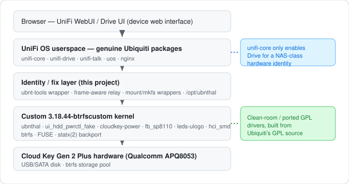

# CloudKey UNAS — run UniFi Drive on a Cloud Key Gen 2 Plus

<div align="center">

<a href="LICENSE"></a>

**Runs Ubiquiti's genuine UniFi Drive stack on a stock UniFi Cloud Key Gen 2 Plus (UCKP).**
**A custom 3.18.44 kernel and clean-room drivers present the console as a NAS-class
board so `unifi-core` will enable Drive — on the real hardware, over SSH, with no
Docker or emulation layer.**

</div>

> [!WARNING]
> This project flashes a custom kernel, modifies the device's root filesystem, and
> can format storage. You can **brick the console, lose data, and void
> warranties**. Proceed only on hardware you own. See [Disclaimer](#disclaimer).

> [!CAUTION]
> **Never click "Eject USB drive"** (Drive WebUI → **All files**). It ejects the
> disk backing the Drive database/pool and can corrupt or lose the storage
> database with no clean way back.

> [!NOTE]
> Not affiliated with Ubiquiti Inc. No Ubiquiti firmware or binaries are
> distributed here — you supply your own. Built with AI assistance under human
> review. See [Legal](#legal).

## Quick start

On a Debian machine that can reach the Cloud Key:

```
git clone https://github.com/hutchx86/cloudkey-unas && cd cloudkey-unas
./install.sh
```

`install.sh` installs its own host dependencies, asks for the Cloud Key's
address and root password, then does everything: build and flash the custom
kernel, install the Drive stack, apply the fix layer, reboot, and verify. It
asks for confirmation before flashing, and on a re-run where the device already
runs the custom kernel it skips the kernel build entirely. First-time pool
creation is still a WebUI step.

## At a glance

|  |  |
| --- | --- |
| **What** | Ubiquiti's genuine UniFi Drive stack running on a Cloud Key Gen 2 Plus |
| **Hardware** | UniFi Cloud Key Gen 2 Plus (UCKP, Qualcomm APQ8053) |
| **Interface** | SSH for provisioning; the on-device Drive stack itself is Ubiquiti's, untouched |
| **Language** | Bash + Python (pipeline), C (kernel modules) |
| **Status** | Working and verified on real hardware; proof of concept |
| **License** | GPL-2.0-only |

## How it compares

|  | Genuine UNAS Pro | This project |
| --- | --- | --- |
| **What it is** | Ubiquiti's standalone NAS appliance | A Cloud Key Gen 2 Plus presented as a NAS-class board |
| **Hardware** | Native NAS SoC + drive backplane | Stock UCKP (APQ8053) + a USB/SATA disk |
| **Cost** | Buy a UNAS Pro | An already-owned Cloud Key |
| **Fidelity** | Native and supported | Proof of concept — custom kernel + identity spoof, not production-ready |

## How it works

`unifi-core` refuses to enable Drive on a stock Cloud Key: it gates the app on the
device identifying as a NAS-class board. This project rebuilds the 3.18.44 vendor
kernel with the drivers such a board exposes, and adds a fix layer over the
installed Ubiquiti packages that spoofs that identity — `/proc/ubnthal` in the
kernel, and a `ubnt-tools` wrapper plus a frame-aware hardware relay in userspace.
The Drive stack itself is Ubiquiti's own, installed from pinned `.deb`s; nothing
is emulated.



| Component | Language | Role |
| --- | --- | --- |
| `install.sh` | Bash | Single entry point: host deps, credentials, build/flash, provision |
| `UNAS-CloudKey/` | Bash | Build + provisioning pipeline (`00`..`05`, `provision-all.sh`) |
| `UNAS-CloudKey/custom-drivers/` | C | Kernel drivers: `ubnthal` identity, fake HDD-bay presence, display, LEDs, power-source, Bluetooth |
| `UNAS-CloudKey/lib/wrappers/` | Python / Bash | `ubnt-tools` identity wrapper, frame-aware hardware relay, mount/mkfs wrappers |
| `scripts/` | Bash / Python | Firmware/deb repack helpers and lint |

## Supported hardware

| Model | SoC / variant | Status | Notes |
| --- | --- | --- | --- |
| Cloud Key Gen 2 Plus (`UCKP`) | Qualcomm APQ8053 | Verified | Drive stack installed and btrfs pool mounted; `05-verify.sh` passes |

## Features

- **Genuine Drive stack** — Ubiquiti's own packages; no userspace reimplementation.
- **Custom 3.18.44 kernel** — built from Ubiquiti's GPL source, with the missing
  CloudKey drivers, btrfs, FUSE, and a `statx(2)` backport.
- **Identity layer** — `/proc/ubnthal` in the kernel plus a `ubnt-tools` wrapper
  and frame-aware relay in userspace present a NAS-class board.
- **One-command install** — `install.sh` bootstraps the Debian host, builds
  and flashes the kernel, then provisions and verifies the Drive stack.
- **Idempotent and re-runnable** — every stage checks state before changing
  anything; a device already on the custom kernel skips the build/flash.
- **No Docker** — everything runs directly on the real hardware over SSH.

## Requirements

- A UniFi Cloud Key Gen 2 Plus, **and its root password**.
- A Debian build host (bullseye or newer) with root or `sudo`, SSH reach to the
  device, and a few GB of free disk for the chroot, kernel source, and kernel
  build. `install.sh` installs the host tools it needs.
- Network access to Ubiquiti's public firmware API and the companion
  kernel-source repo. The scripts download and checksum-verify; nothing is
  redistributed here.

## Repository layout

```
install.sh       single entry point: host deps -> build/flash -> provision
UNAS-CloudKey/   build + provisioning pipeline (00..05, provision-all.sh)
    custom-drivers/   kernel drivers (GPL-2.0; see CREDITS.md)
    lib/              SSH helper + on-device wrappers
scripts/         firmware repack helpers + lint
fw_picked/       package lists; binaries are regenerated, not stored
docs/images/     README assets
```

## Install / Usage

`./install.sh` is the only command needed. It runs the whole pipeline in order
and is safe to re-run. Run it from the repository root on the Debian build host
(not on the device).

**What it asks**

- The Cloud Key address (e.g. `<cloudkey-ip>`, or `user@host`) and its root
  password.
- A typed `yes` before the kernel is flashed — the one destructive step.

**What it does**

| Stage | Script | Runs on |
| --- | --- | --- |
| Install missing host tools | `install.sh` | build host |
| Regenerate the pinned Ubiquiti `.deb`s | `scripts/fetch-firmware-debs.sh` | build host |
| Read the device's running config, live DTB, and stock boot partition | `install.sh` | build host → device |
| Create the bullseye chroot | `UNAS-CloudKey/00-create-chroot.sh` | build host (root/sudo) |
| Build the custom kernel | `UNAS-CloudKey/01-build-kernel.sh` | build host (chroot) |
| Back up, transfer, and flash the kernel + modules | `UNAS-CloudKey/02-flash-kernel.sh` | build host → device |
| Reboot into the new kernel | `install.sh` | build host → device |
| Install, fix, reboot, verify | `UNAS-CloudKey/provision-all.sh` (`03`/`04`/`05`) | build host → device |

If the device already runs `3.18.44-btrfscustom`, the kernel stages are skipped;
`--rebuild-kernel` forces them. `--yes` makes the run non-interactive (requires
`DEVICE_HOST` and `DEVICE_PASSWORD` in the environment, and skips the flash
confirmation).

**Advanced — run stages individually**

The `0N` prefixes are the pipeline order; these are the same steps `install.sh`
drives, for re-running one stage or debugging. `02` and `provision-all.sh` read
`DEVICE_HOST` and `DEVICE_PASSWORD` from the environment; `00` must run as root
(or via `sudo`).

```
# pinned packages (needed by 03; not stored in the repo)
scripts/fetch-firmware-debs.sh

# 00: create the bullseye chroot once, then 01 inside it
sudo UNAS-CloudKey/00-create-chroot.sh
KERNEL_SRC_REPO=https://github.com/hutchx86/ckg2plus-kernel-src.git \
  UNAS-CloudKey/01-build-kernel.sh          # inside the chroot

# 02: flash the built image + module tree (asks for confirmation)
UNAS-CloudKey/02-flash-kernel.sh <path>/new-boot.img <path>/modules-staging

# provision-all.sh: install, fix, reboot, verify (03/04/05)
UNAS-CloudKey/provision-all.sh
```

`01` needs the device-derived `verified-running.config`, `cloudkey-live.dtb`,
`bootimg.cfg`, and `initrd.img` in its working directory (see its header);
`install.sh` produces these under `$BUILD_DIR`. It writes `new-boot.img` and a
`modules-staging/` tree, and prints the exact `02` command to run next.

## Configuration

`install.sh` flags: `--rebuild-kernel`, `--yes`, `--help`. Environment overrides:

| Key | Default | Meaning |
| --- | --- | --- |
| `DEVICE_HOST` | prompted | Cloud Key address (`root@` assumed for a bare IP) |
| `DEVICE_PASSWORD` | prompted | device root password |
| `KERNEL_SRC_REPO` | `ckg2plus-kernel-src` companion repo | kernel source repo to clone (a local tarball/GPL bundle also works — see `01`'s header) |
| `BUILD_DIR` | `$HOME/ck-kernel-build` | kernel build + device-input staging |
| `CHROOT_PATH` | `$HOME/bullseye-chroot` | bullseye build chroot |
| `BOOT_PARTITION` | `/dev/mmcblk0p42` | device boot partition backed up for `bootimg.cfg`/`initrd.img` |
| `SSH_CONTROL_SOCKET` | `/tmp/ck_ssh_ctrl.sock` | SSH ControlMaster socket |
| `FLASH_CONFIRM` | — | `yes` skips `02`'s flash confirmation |
| `REBOOT_WAIT_MAX_SECS` | `900` | max wait for the rebooted device |

## Verification

- Static checks: `scripts/lint.sh` (`bash -n`, `shellcheck`, Python compile).
- Device state: `UNAS-CloudKey/05-verify.sh` (kernel, modules, identity, Drive
  API, relay, pool mount, failed units).

## Roadmap / known limitations

- **Known:** proof of concept, not production-ready — see [Disclaimer](#disclaimer).
- **Known:** first-time storage-pool creation is a manual WebUI action
  ("Add Drives"); no script performs it.
- **Known:** installing an app through the `unifi.ui.com` cloud portal fails;
  installing by direct URL works.
- **Known:** untested kernel drivers ship as loadable modules and must be
  exercised before being promoted to built-in.
- **Planned:** detect the device's UniFi OS version at runtime and act
  accordingly — today the pinned debs come from UNAS2 6.0.9 and `03` only
  special-cases trixie vs bullseye via `/etc/os-release`.

## Changelog

- **2026-09-20** — Verified on **UniFi OS 6.0.9** (Debian trixie): pinned
  packages are rebuilt from the **UNAS2 6.0.9** firmware, and a single
  `install.sh` drives the whole pipeline (build kernel → flash → reboot →
  provision → verify) on a stock Cloud Key.
- **2026-09-19** — Added the single-command `install.sh` entry point; README
  and docs reworked.
- **2026-09-14** — Initial public release (GPL-2.0-only); verified on a stock
  Cloud Key Gen 2 Plus after an in-place v6.0.7 firmware update.

## Troubleshooting

<details>
<summary><b>Troubleshooting / FAQ</b></summary>

**`provision-all.sh` aborts with "is running kernel ..., expected
`3.18.44-btrfscustom`"** — the custom kernel isn't flashed yet. Build and flash
it with `01`/`02` first.

**Drive refuses to enable, or shows no storage** — same cause: the stock kernel
is still running. Check `uname -r` on the device.

**Drive file and folder listings return HTTP 500** — the kernel lacks the
`statx(2)` backport; use the kernel built by `01-build-kernel.sh`, which includes
it.

</details>

## Credits

Special thanks to [dciancu](https://github.com/dciancu) for
[unifi-protect-unvr-docker-arm64](https://github.com/dciancu/unifi-protect-unvr-docker-arm64) —
the direct inspiration for this project, and the reference for the original
firmware-extract / `dpkg-repack` approach.

Third-party kernel code and its licenses are listed in [CREDITS.md](CREDITS.md).

<details>
<summary><b>Legal</b></summary>

- **Not affiliated with, or endorsed by, Ubiquiti Inc.** "UniFi", "Cloud Key",
  "UniFi Drive", and "UNAS" are trademarks of Ubiquiti Inc.
- **No Ubiquiti binaries or firmware are distributed here.** The scripts
  download firmware and packages from Ubiquiti's public endpoints or expect you
  to provide them. Redistributing Ubiquiti packages may be subject to Ubiquiti's
  terms — don't.
- This project is intended for interoperability and personal use on hardware you
  own. Reverse engineering may be restricted in your jurisdiction; you are
  responsible for how you use it.

</details>

<details>
<summary><b>Disclaimer</b></summary>

**This is a proof-of-concept project, not a production-ready system**, and it is
**not recommended for an actual production system**. Large parts were produced
with LLMs (Claude Code and DeepSeek) under strict human supervision and testing —
review and verify everything yourself. **This software is provided "as is",
without warranty of any kind.** It performs invasive operations: flashing a custom
kernel, modifying the root filesystem, and interacting with storage. There is a
genuine risk of **bricking the device, rendering it unbootable, losing data, or
permanently damaging hardware**. Recovery may require physical access and a
recovery console, and is never guaranteed.

By using this project you accept full responsibility for any damage, data loss,
downtime, or other consequences. **The authors and contributors are not
responsible or liable for any loss or damage arising from its use.** Only proceed
if you understand the risks and are working on hardware you own.

</details>

## Security

Report vulnerabilities privately through
[GitHub Security Advisories](../../security/advisories/new). No credentials are
stored in the repository: the device root password is passed in via the
`DEVICE_PASSWORD` environment variable.

## License

GPL-2.0-only. See [LICENSE](LICENSE). The kernel drivers in
`UNAS-CloudKey/custom-drivers/` derive from GPL-2.0 sources (mainline `fbtft`,
Qualcomm/CodeAurora `hci_smd`) and declare `MODULE_LICENSE("GPL")`, which is why
the project as a whole is GPL-2.0.
